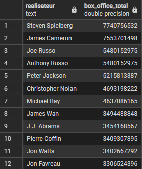

# Structure SQL & Requêtes analytiques

Ce dossier contient le script SQL de création du schéma relationnel (`schema.sql`), une série de requêtes SQL (`requetes.sql`) pour explorer les données issues de l’API TMDb, ainsi que des exemples visuels des résultats (captures d'écran). Les résultats de chaque requêtes sont présentés en bas de cette page. 

## Schéma relationnel 

La base est structurée autour d’une table principale `films`, reliée à plusieurs tables de dimensions via des tables d’association (id_a, id_b).


*NB : schéma dessiné avec drawsql.app* 

## Récapitulatif des requêtes SQL

*NB : la difficulté des requêtes est croissante*

| #  | Titre                                                   | Description                                                   |
|----|---------------------------------------------------------|---------------------------------------------------------------|
| 1  | Popularité de Adam Sandler                              | Récupérer la popularité de l’acteur via les tables liées      |
| 2  | 10 films les plus populaires                            | Trier les films avec le plus de votes par note moyenne        |
| 3  | Box-office vs succès critique                           | Comparer bénéfice financier et note moyenne                   |
| 4  | Producteurs les plus rentables                          | Classer les producteurs par bénéfice cumulé                   |
| 5  | Réalisateurs les plus rentables                         | Idem pour les réalisateurs                                    |
| 6  | Meilleur film de chaque année                           | Trouver le top 1 de chaque année (> 2000 votes)               |
| 7  | Genres les plus rentables                               | Contribution au bénéfice global par genre                     |
| 8  | Top 3 films par décennie                                | Identifier les meilleurs films pour chaque grande période     |
| 9  | Acteurs populaires = plus de bénéfices ?                | Comparaison entre popularité et performance au box-office     |
| 10 | Meilleur film vs budget moyen la même année             | Comparer le budget du meilleur film à la moyenne annuelle     |
| 11 | Duos d’acteurs les plus fréquents                       | Trouver les binômes les plus souvent castés ensemble          |
| 12 | Proportion des plus gros bénéfices                      | Analyse de la concentration des bénéfices parmi les top films |

Les requêtes complètes sont disponibles dans le fichier [`requetes.sql`](./requetes.sql) et les résultats (captures d'écran) disponibles dans le fichier [`images/`](../images/).

Pour illustrer, je vais en montrer 3 dans ce README

## Exemples

5. Les réalisateurs les plus rentables

```sql
WITH top_real AS (
	SELECT nom, realisateur_id, budget, revenu,
	revenu - budget AS box_office
	FROM realisateurs AS r
	JOIN films_realisateurs AS fr
	ON r.id = fr.realisateur_id 
	JOIN films AS f
	ON f.id = fr.film_id
)

SELECT 
	nom AS realisateur, 
	SUM(box_office) AS box_office_total
FROM top_real
GROUP BY realisateur_id, nom
ORDER BY box_office_total DESC
LIMIT 20;
```

Objectif : Récupérer les realisateurs les plus rentables, pour ça on doit faire une triple jointures (on doit joindre les films et les réalisateurs via la table de relation films_realisateurs). On groupe ensuite par id du réalisateur et par nom (pour pouvoir l'afficher sans sous requêtes supplémentaire) pour pouvoir faire la somme des box offices. Ajouter le nom dans le GROUP BY n'est ici pas dangereux étant donné que ce sont des paires uniques. 

Résultat :



10. Meilleurs films comparé au budget moyen de tous les films de la même année

```sql
WITH 
	cte AS (
	SELECT 
	annee, titre, budget,
	RANK() OVER (PARTITION BY annee ORDER BY note_moyenne DESC, nb_votes DESC) AS rang
	FROM (SELECT *, EXTRACT(YEAR FROM date_sortie) AS annee FROM films)
	WHERE nb_votes > 2000),
	budget_moyen_an AS ( 
	SELECT 
	ROUND(AVG(budget)::numeric, 0) AS budget_moyen, 
	EXTRACT(YEAR FROM date_sortie) AS annee
	FROM films
	WHERE budget IS NOT NULL AND budget > 0
	GROUP BY EXTRACT(YEAR FROM date_sortie))

SELECT 
	c.annee, titre, budget AS budget_film, budget_moyen,
	budget - budget_moyen AS difference,
	CONCAT(
	ROUND((budget - budget_moyen)::numeric * 100 
	/ budget_moyen, 2), '','%') AS ecart_pourcent
	FROM cte AS c
	JOIN budget_moyen_an AS b
	ON c.annee = b.annee
	WHERE rang = 1
	ORDER BY annee;
```

Objectif : Pour chaque année on va récupérer le meilleur film. Ici meilleur film est considéré par rapport à la note moyenne (d'où le RANK ORDER BY sur la note moyenne) mais également une condition importante, c'est que le film ait reçu un assez grand nombre d'avis, sinon on a des résultats biaisés (i.e. des films très bien notés, mais qui n'ont que très peu d'avis). Dans une seconde vue on calcule le budget moyen de tous les films réunis de chaque année. Puis on effectue une jointure justement sur les années, on ajoute deux colonnes permettant de quantifier les différence : la colonne difference et l'ecart en %.

Résultat : 

[Requête n°10](../images/requete_10.png)

*NB : Résultat limités à cause de la place sur la capture d'écran*


12. Proportion des 10, 100 et 500 plus gros bénéfices, par rapport aux benefices totaux de l'industrie

```sql
WITH classement_benef AS (
	SELECT  
		titre,
		benefice,
		DENSE_RANK() OVER (ORDER BY benefice DESC) AS rang 
		FROM (
			SELECT titre, revenu - budget AS benefice
			FROM films
			WHERE revenu IS NOT NULL AND budget IS NOT NULL 
			AND revenu - budget > 0)
)

SELECT 
	10 AS proportion, 
	ROUND(
		( SUM(benefice)::numeric * 100 ) / 
		(SELECT SUM(benefice)::numeric FROM classement_benef), 	
		2) AS pourcentage
FROM classement_benef
WHERE rang <= 10

UNION ALL 

SELECT 
	100 AS proportion, 
	ROUND(
		(SUM(benefice)::numeric * 100) / 
		(SELECT SUM(benefice)::numeric FROM classement_benef) ,
		2) AS pourcentage
FROM classement_benef
WHERE rang <= 100 

UNION ALL 

SELECT 
	500 AS proportion,
	ROUND(
		(SUM(benefice)::numeric * 100) / 
		(SELECT SUM(benefice)::numeric FROM classement_benef), 
		2) AS pourcentage
FROM classement_benef
WHERE rang <= 500;
```

Objectif : L'objectif ici est de comparé la proportion des revenu des plus gros films par rapport aux revenus totaux de l'industrie. Pour ça on prend 3 mesures, les 10, 100 et 500 plus gros films en termes de box office, pour ça on utiliser donc un DENSE_RANK ordonnés sur les bénéfices, de manière décroissante. à partir de cette vue, on calcule les 3 proportions manuellement puis on les ajoutes à la ligne grâce aux UNION ALL (ou UNION), nécessité d'avoir les mêmes noms de colonne.

Résultat : 

[Requête n°12](../images/requete_12.png)

*se lit : les 10 meilleurs films en termes de revenu représentent 4,56% des revenus totaux de l'industrie (sur une base de 25 000 films)*